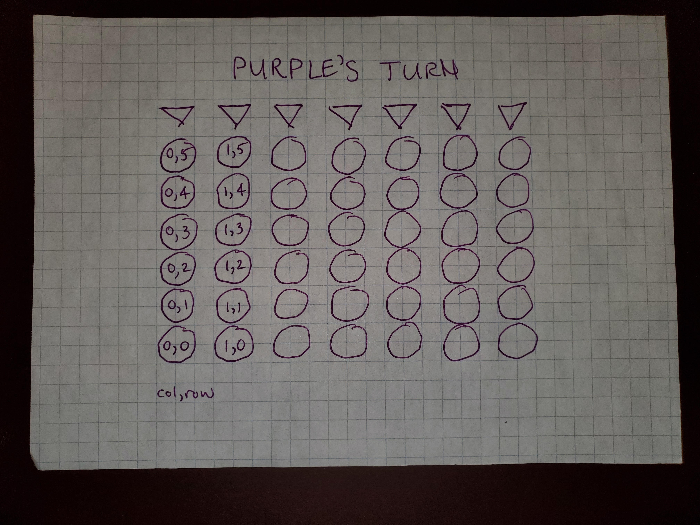

## To sync your code with the repo's

> IMPORTANT:  Be sure to save all files before syncing!

- git fetch --all
- git reset --hard origin/main

The above commands will result in your local repo mirroring the remote's code exactly.  Any changes you've made to files, committed or not, will be replaced by the files in the remote (origin).

## Wireframe

